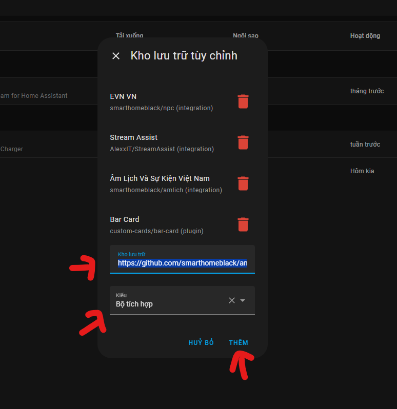
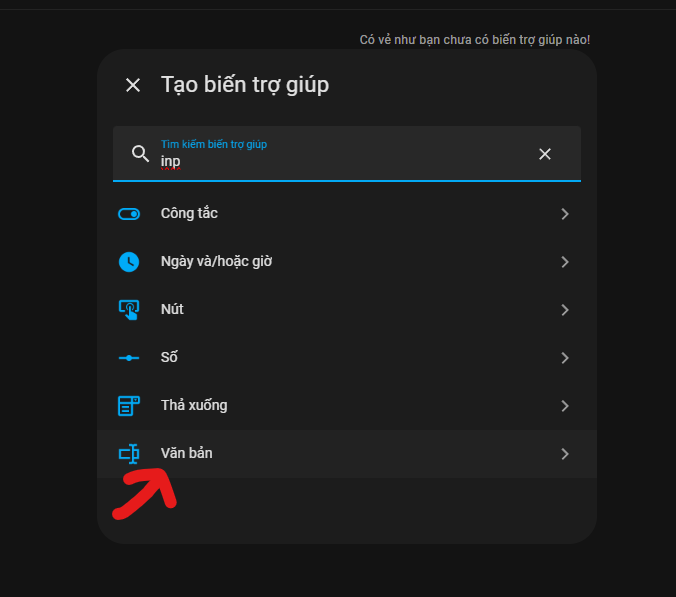
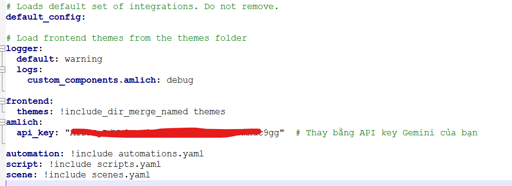
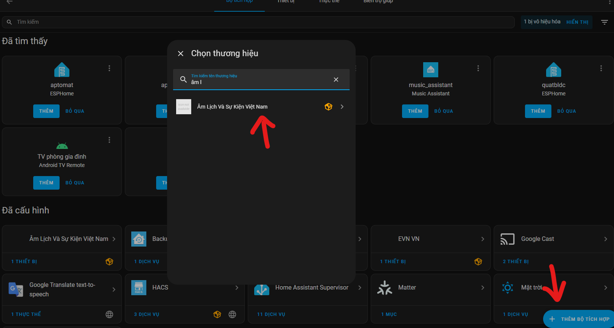
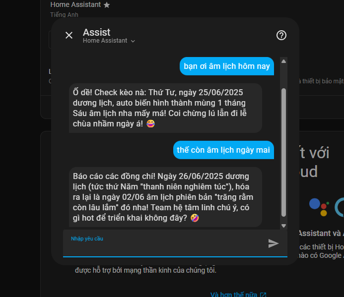
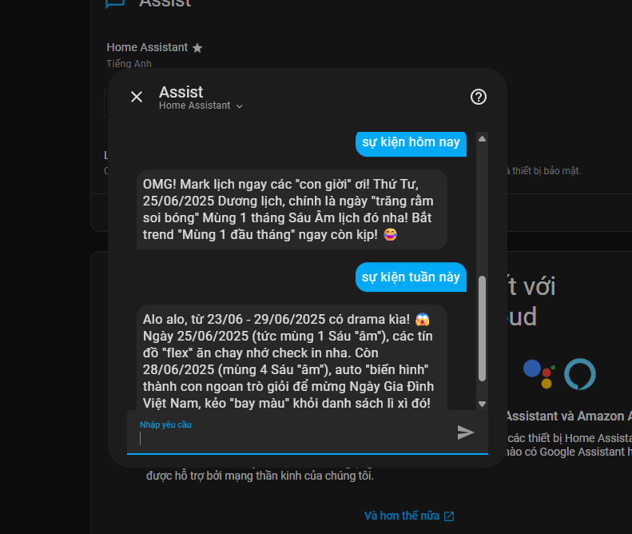
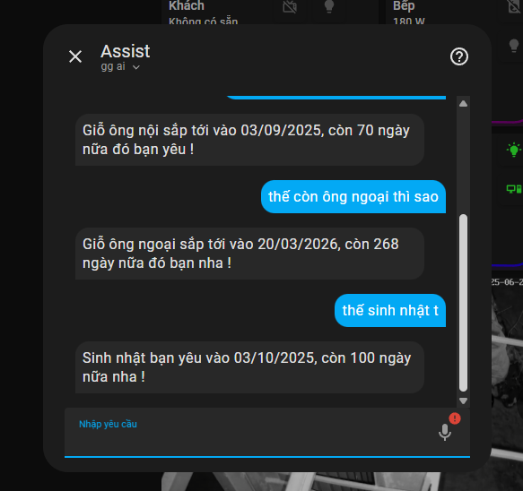
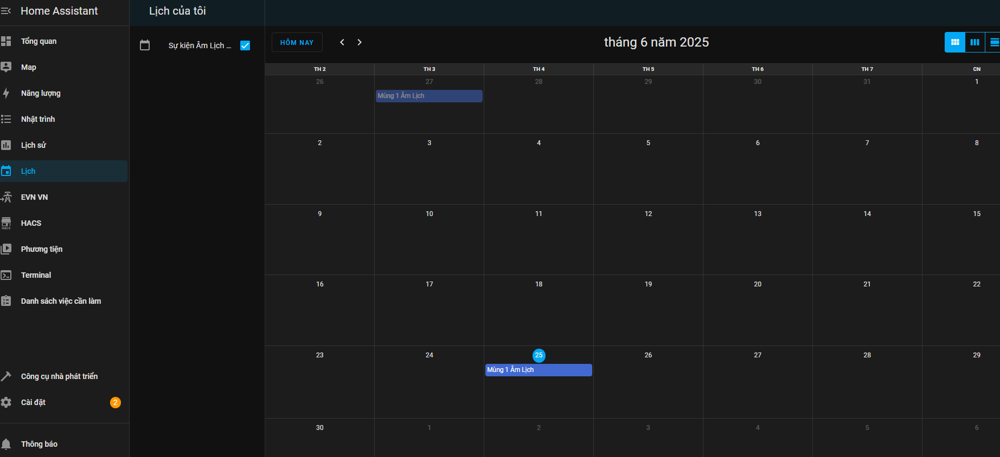
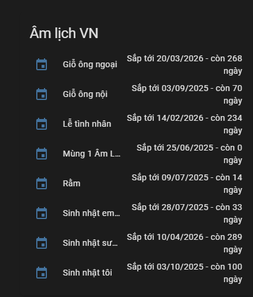

# 📅 Lịch Âm cho Home Assistant (Custom Component)

Tiện ích giúp tra cứu **Âm Lịch**, **Dương Lịch**, và **Sự Kiện** theo ngày qua giao diện Home Assistant hoặc lệnh thoại (AI). Hỗ trợ tra cứu âm lịch sang dương lịch, hiển thị sự kiện từ file `amlich.ics`, và tùy chỉnh giọng điệu hài hước bằng công tắc.

**Cập nhật mới nhất**:
- **22h 25/6/2025**: Thêm tính năng tạo sự kiện, chính sửa. tạo cảm biến các sự kiện để dễ dàng theo dõi.(ai đã cài bản trước ngày này thì vào `configuration.yaml` xóa dòng   `path: "/config/amlich.ics"` và `sensor:  - platform: amlich`)
- **19h 13/5/2025**: Cập nhật file `amlich.ics` chuẩn, đầy đủ dữ liệu đến năm 2055.
- **9h 15/5/2025**: Thêm nhiều sự kiện vào `amlich.ics`, tối ưu tự động hóa, hỗ trợ tra cứu âm lịch sang dương lịch, thêm công tắc `input_boolean.use_humor` để bật/tắt giọng điệu hài hước.

> **Lưu ý**: Nếu cập nhật, **xóa tất cả tự động hóa cũ** liên quan đến `amlichvietnam` trước khi áp dụng tự động hóa mới dưới đây.

---

## 🛠️ Cài đặt

### 1. Tải dự án

#### Cách 1. Cài tự động qua HACS

- Vào HACS -> Thêm kho lưu trữ tùy chỉnh:
`https://github.com/smarthomeblack/amlich`



- Sau đó tìm Âm Lịch Và Sự Kiện Việt Nam hoặc bấm vào nút bên dưới

[](https://my.home-assistant.io/redirect/hacs_repository/?owner=smarthomeblack&repository=amlich)

- Tải về sau đó khởi động lại Home Assistant

#### Cách 2.  Cài thủ công
- Tải và giải nén dự án này.
- Copy thư mục `amlich` vào thư mục `custom_components` của Home Assistant.
- Copy file `amlich.ics` vào thư mục gốc của Home Assistant (ngang hàng với `configuration.yaml`).

#### Cấu trúc thư mục tham khảo:
```text
/config/
├── configuration.yaml
├── custom_components/
│   ├── amlich/
│   │   ├── __init__.py
│   │   ├── amlich_core.py
│   │   ├── sensor.py
│   │   └── ...
├── amlich.ics
```

### 2. Tạo biến trợ giúp

- Vào **Settings → Devices & Services → Helpers**.
- Tạo **Input Text**:
  - Tên: `Tra cứu`.
  - Entity ID: `input_text.tracuu`.



### 3. Cấu hình trong `configuration.yaml`

Thêm đoạn cấu hình sau:

```yaml
amlich:
  api_key: "your_gemini_api_key"  # Thay bằng API key Gemini của bạn
```


### 4. Khởi động lại Home Assistant

- Sau khi khởi động lại, vào Cài Đặt -> Thiết bị -> Thêm bộ tích hợp Âm lịch và Sự Kiện Việt Nam



### 5. Kiểm tra


- Đảm bảo `input_text.tracuu` tồn tại.

---

## ⚙️ Tạo tự động hóa (Automation)

### Tự Động Tra Cứu Nâng Cao

> **Quan trọng**: Xóa mọi tự động hóa cũ liên quan đến `amlichvietnam` trước khi thêm automation mới.

Thêm automation sau vào `automations.yaml` hoặc qua giao diện:

```yaml
alias: Tra cứu sự kiện nâng cao
description: Tra cứu sự kiện nâng cao
triggers:
  - trigger: conversation
    command:
      - "{a} su kien {sukien}"
      - su kien {sukien}
      - "{a} sự kiện {sukien}"
      - sự kiện {sukien}
      - "{a} am lich {duonglich}"
      - am lich {duonglich}
      - "{a} âm lịch {duonglich}"
      - âm lịch {duonglich}
      - "{a} duong lich {amlich}"
      - duong lich {amlich}
      - "{a} dương lịch {amlich}"
      - dương lịch {amlich}
conditions: []
actions:
  - action: input_text.set_value
    metadata: {}
    data:
      value: >-
        {{ 'Âm lịch ' ~ trigger.slots.amlich if trigger.slots.amlich is defined
        else 'Dương lịch ' ~ trigger.slots.duonglich if trigger.slots.duonglich
        is defined else 'Sự kiện ' ~ trigger.slots.sukien if
        trigger.slots.sukien is defined else 'Không có thông tin phù hợp' }}
    target:
      entity_id: input_text.tracuu
  - variables:
      old_value: "{{ states('sensor.tra_cuu_su_kien') }}"
  - wait_template: "{{ states('sensor.tra_cuu_su_kien') != old_value }}"
    timeout: "00:00:5"
    continue_on_timeout: true
  - if:
      - condition: state
        entity_id: switch.use_humor
        state: "on"
    then:
      - delay:
          hours: 0
          minutes: 0
          seconds: 4
          milliseconds: 0
  - set_conversation_response: >-
      {{ state_attr('sensor.tra_cuu_su_kien', 'output') | default('Không có dữ
      liệu sự kiện, vui lòng thử lại!', true) }}
mode: single


```

---

## 🧪 Mẹo khắc phục

- **Kết quả chậm hoặc không phản hồi**:
  - Tăng `timeout` trong automation từ `00:00:15` lên `00:00:20` nếu dùng Gemini API (khi bật `input_boolean.use_humor`).
  - Kiểm tra log:
    ```bash
    cat /config/homeassistant.log | grep amlich
    ```
- **Lỗi API**:
  - Xác nhận `api_key` trong `configuration.yaml` đúng.
  - Kiểm tra kết nối mạng tới Gemini API.

---

## 🤖 Tùy chỉnh giọng điệu hài hước

- **Công tắc**: Bật `Use Humor` trên Thiết bị để trả kết quả với giọng điệu dí dỏm (dùng Gemini AI).
- **Hiệu ứng**:
  - Khi bật: Kết quả sinh động, ví dụ: "Lễ Phật Đản, trời xanh mây trắng tha hồ chill!"
  - Khi tắt: Kết quả nghiêm túc, ví dụ: "Ngày 12/05/2025 là Lễ Phật Đản."
- **Lưu ý**: Bật công tắc có thể làm phản hồi chậm hơn 2-3 giây do gọi Gemini API.

---

## 🧑‍🏫 Hướng dẫn sử dụng

### 1. Tra cứu Âm Lịch
- Dùng từ khóa **"âm lịch"** trong lệnh.
- Ví dụ:
  - "Âm lịch hôm nay" → "Dương lịch 15/05/2025 là ngày 18/04/2025 âm lịch!"
  - "Âm lịch 12/12/2025" → Tra cứu ngày âm lịch tương ứng.
  - "Âm lịch ngày mai" → Thông tin ngày âm lịch của ngày mai.

### 2. Tra cứu Dương Lịch
- Dùng từ khóa **"dương lịch"**.
- Ví dụ:
  - "Dương lịch 12/12/2025" → "Dương lịch 12/12/2025 là ngày 16/11/2025 âm lịch!"
  - "Dương lịch hôm nay" → Thông tin ngày hiện tại.

### 3. Tra cứu Sự Kiện
- Dùng từ khóa **"sự kiện"**.
- Ví dụ:
  - "Sự kiện tuần này" → Liệt kê sự kiện từ 12/05/2025 đến 18/05/2025 (ví dụ: Lễ Phật Đản, Ngày của mẹ).
  - "Sự kiện tháng 5" → Sự kiện trong tháng 5/2025.
  - "Sự kiện 12/05/2025" → Sự kiện cụ thể của ngày.

### 4. Sử dụng qua Dashboard
- Nhập truy vấn vào `input_text.tracuu` (ví dụ: "Sự kiện tuần này").
- Kết quả hiển thị trong `sensor.tra_cuu_su_kien` (state và attributes).

---

## 🖼️ Ảnh demo

Xem thư mục `image/`:












---

## 📩 Góp ý & Liên hệ

- Tạo **issue** hoặc **pull request** trên repository nếu có lỗi hoặc muốn cải tiến.
- Liên hệ qua cộng đồng Home Assistant Việt Nam.

Chúc bạn sử dụng vui vẻ! ✨
